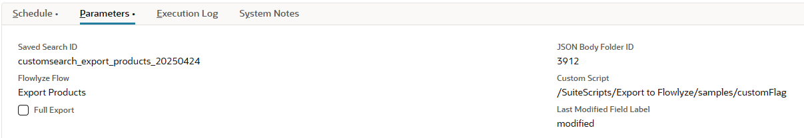

# Export from NetSuite to Flowlyze

The **Map/Reduce SuiteScript "Export from NetSuite"** is a script built using NetSuite 2.1 API that enables exporting data from a NetSuite saved search to an external Flowlyze endpoint. The script:

* Loads and filters records based on the last execution date.
* Batches the results for optimized processing.
* Applies a customizable transformation logic through an external module.
* Sends the transformed data to Flowlyze’s API.
* Logs the result of the export by creating a custom record in NetSuite.

---

## SuiteScript

To configure the export flows, you must create a script from the [exportToFlowlyze.js](../src/FileCabinet/SuiteScripts/Export%20to%20Flowlyze/exportToFlowlyze.js) file.
It's fundamental to configure the following parameters

#### Deployment Parameters

| Parameter Name                         | Description                                                                                                                                                       | Type     |
|---------------------------------------|-------------------------------------------------------------------------------------------------------------------------------------------------------------------|----------|
| `custscript_fly_saved_search_id`      | ID of the saved search from which to extract data.                                                                                                                | Integer  |
| `custscript_fly_folder_id`            | ID of the File Cabinet folder to store JSON files of the exports that have been completed.                                                                                                                | Integer  |
| `custscript_fly_flow`                 | Name of the integration flow used to retrieve configuration. This name must match the name of an instance of the custom record `customrecord_fly_flowlyze_integration`, which stores all necessary info for Flowlyze calls. | String   |
| `custscript_fly_custom_script`        | AMD module path exposing the `transformRows(rows)` function.                                                                                                      | String   |
| `custscript_fly_full_flag`            | Boolean flag: `true` for full export, `false` for delta-only.                                                                                                     | Boolean  |
| `custscript_last_modified_field_label`| Label of the field to use for sorting and filtering by last modified date.                                                                                        | String   |

---
Here comes an example of parameters configuration:


## Key Features

### 1. Saved Search Retrieval and Delta Filtering

1. Loads the saved search using the `custscript_fly_saved_search_id` parameter.  
2. If `custscript_fly_full_flag` is `false`, it calls `getLastExecutionDate(flow)` to retrieve the last execution timestamp from `customrecord_fly_flow_execution`.  
3. Adds a filter to include only records with a last modified date greater than the last execution.  

### 2. Sorting and Pagination

* Always adds a `DATETIME` column (labelled `fly_lastmodifieddate`) and sorts it in ascending order.
* Uses a custom implementation of `getAllResults()` to paginate saved search results in batches of 1000 records.

### 3. Chunking for Export

* In the `map` stage, each result is stringified to JSON and assigned a `chunkKey = floor(index/10)`.
* Batches of ~10 records are grouped for the `reduce` stage, optimizing performance and API payload size.

### 4. Reduce Phase: Transformation and API Call

1. In `reduce`, reads grouped values and calls `processValues(values)`.
2. Fetches integration configuration using `getIntegrationConfigRecord(flow)` to obtain:
   * API endpoint URL  
   * API key  
   * Flow and entity names  
3. Prepares a transformation function `transformFn`:
   * Defaults to identity transformation.
   * If `custscript_fly_custom_script` is set, it requires the given AMD module and retrieves `transformRows()`.
4. Calls `processExport(rows, transformFn, folderId, config)`:
   * Applies the transformation.
   * Saves the transformed JSON file in File Cabinet (`saveToFile`).
   * Sends a POST request to `config.url` with headers including `x-apikey`, and body `{ data: [...] }`.
   * If response is 2xx, stores an execution log in `customrecord_fly_flow_execution` with the timestamp and fileId of the export.

---

## Error Handling

* Every critical block (`getInputData`, `processValues`, API call) is enclosed in `try...catch`.
* Errors are logged using `log.error` and do not block the entire process.
* If a single chunk fails, the process continues with the remaining chunks.

---

## Custom Transformation Module Structure

The optional AMD module specified in `custscript_fly_custom_script` must export the following:

```javascript
/**
 * @NApiVersion 2.1
 * @NModuleScope Public
 */
define([], function() {
    /**
     * Transforms rows before export.
     * @param {Array<Object>} rows - Array of record objects in JSON format.
     * @returns {Array<Object>} transformedRows
     */
    function transformRows(rows) {
        // Example: filter only rows where "active" is true
        return rows.filter(r => r.active === true);
    }

    return {
        transformRows: transformRows
    };
});
```
