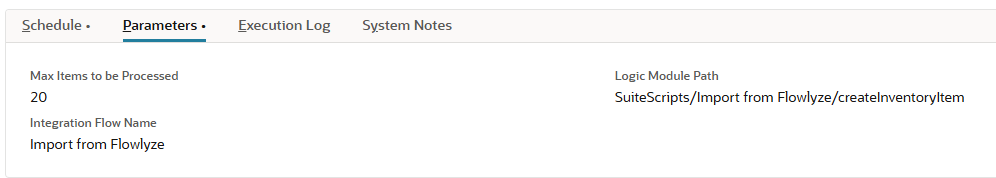

# Import from Flowlyze to NetSuite

The **"Import from Flowlyze"** SuiteScript is a **Scheduled Script** based on **NetSuite 2.x API** that enables data integration between Flowlyze and NetSuite.  
Its main purpose is to handle message import: it retrieves data from a Flowlyze queue via API, processes it through a dynamically loaded custom logic module, and sends an acknowledgment of the outcome—both in case of success and error.

_For more details: [**Flowlyze Docs - HTTP Message Queue**](https://ipaas-doc.vercel.app/docs/concetti-generali/destination/http-message-queue#queue)._

---

## SuiteScript

To configure the export flows, you must create a script from the [importFromFlowlyze.js](../src/FileCabinet/SuiteScripts/Import%20From%20Flowlyze/importFromFlowlyze.js) file.
It's fundamental to configure the following parameters

#### Deployment Parameters

| Parameter Name               | Description                                                                  | Type    |
|-----------------------------|------------------------------------------------------------------------------|---------|
| `custscript_fly_max_items`  | (Optional) Max number of messages to process per execution (default is 10)  | Integer |
| `custscript_fly_int_flow`   | (Mandatory) Name of the integration flow used to retrieve configuration. This name must match the name of an instance of the custom record `customrecord_fly_flowlyze_integration`, which stores all necessary info for Flowlyze calls.                 | String  |
| `custscript_fly_logic_module` | (Mandatory) Path to the custom logic module that processes the data                  | String  |

---

Here comes an example of parameters configuration:


## Main Features

### 1. Retrieve Integration Configuration

The function `getIntegrationConfigRecord(flow)` performs a `search.create` on the custom record `customrecord_fly_flowlyze_integration` to retrieve:

- Endpoint URL  
- API Key  
- Flow name and associated entity  

**Note:** If the configuration is not found, an error is thrown and the script is halted.

---

### 2. Fetch Messages

The function `fetchMessages(integrationConfig, maxItems)` sends an HTTP GET request to the configured endpoint with the following query parameters:

- `is-acknowledged=false`  
- `max-items` set according to the script parameter  

The response body is parsed to extract the `messages` array.

---

### 3. Load Custom Module and Process

The script dynamically loads the custom logic module (e.g. `/SuiteScripts/myCustomLogic.js`) using `require`.

It looks for a `processData(message)` function inside the module.

For each message:

- `processData` is called  
- If the result is an error or missing, it is logged and handled

---

### 4. Acknowledge Messages

The `acknowledgeMessage(msgId, status, errorMessage, integrationConfig)` function sends an HTTP POST request to the `/acknowledge` endpoint.  
The request body includes:

- Message ID  
- Status (`Success` or `Error`)  
- Error message (if any)  

The optional `isAsync` parameter indicates whether the acknowledgment should run asynchronously.  
This informs Flowlyze whether the message was correctly handled or if an error occurred.

_For more details and examples: [**Flowlyze Docs**](https://ipaas-doc.vercel.app/docs/concetti-generali/destination/http-message-queue#queue)._

---

## Error Handling

- All major code blocks are protected by `try...catch`.
- Errors are logged using `log.error` with descriptive messages.
- If processing or acknowledgment of a message fails, the error is handled without blocking other messages.

---

## Required Structure of the Custom Module

The custom logic module must export at least one function with the following structure:

```javascript
/**
 * @NApiVersion 2.x
 * @NModuleScope Public
 */
define(['N/log'], function(log) { 
    function processData(data) {
        try {
            log.debug('Processing Input Data', JSON.stringify(data));

            // Example: basic validation on an "isValid" field
            if (!data.isValid) {
                return { success: false, error: 'Validation failed: "isValid" field is false or missing.' };
            }

            return { success: true };
        } catch (e) {
            log.error('Processing Error', e.message);
            return { success: false, error: e.message };
        }
    }

    return {
        processData: processData
    };
});
```